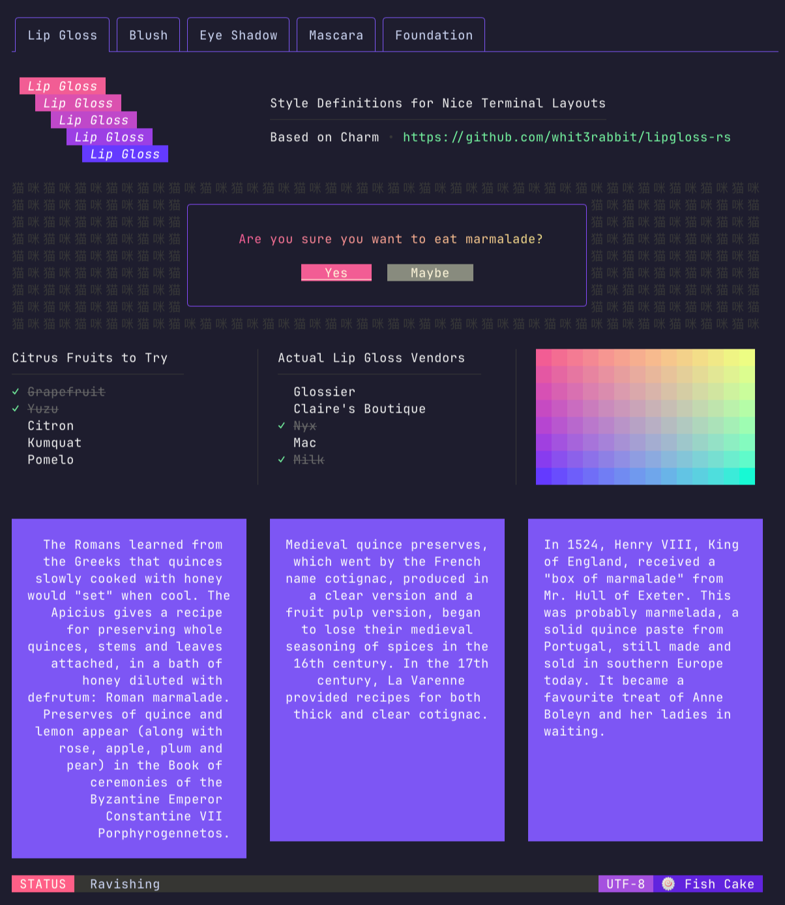
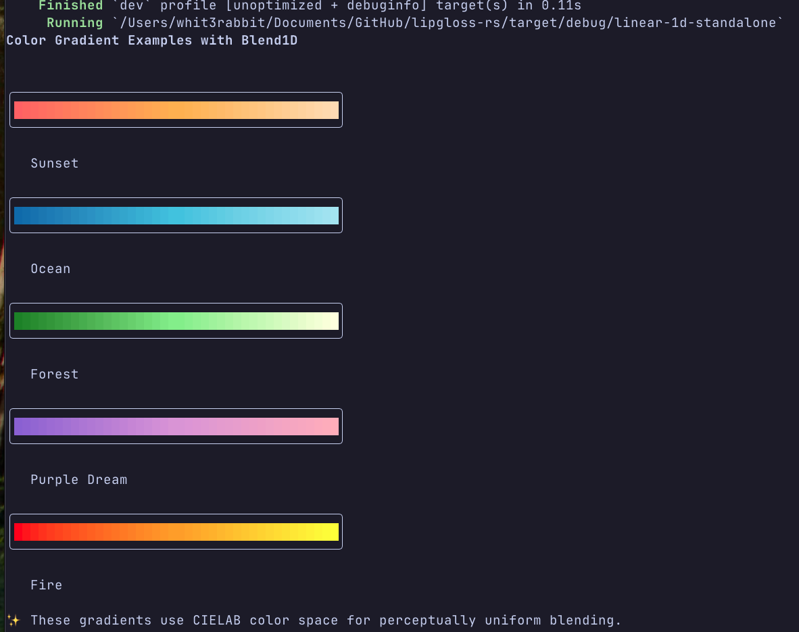
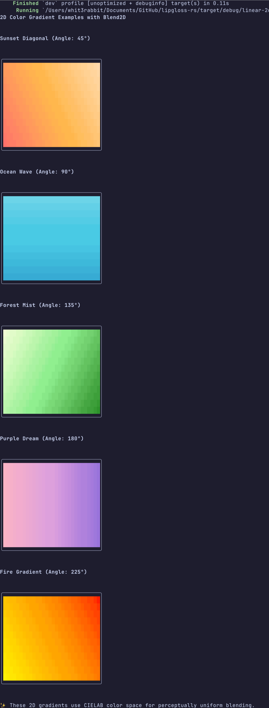
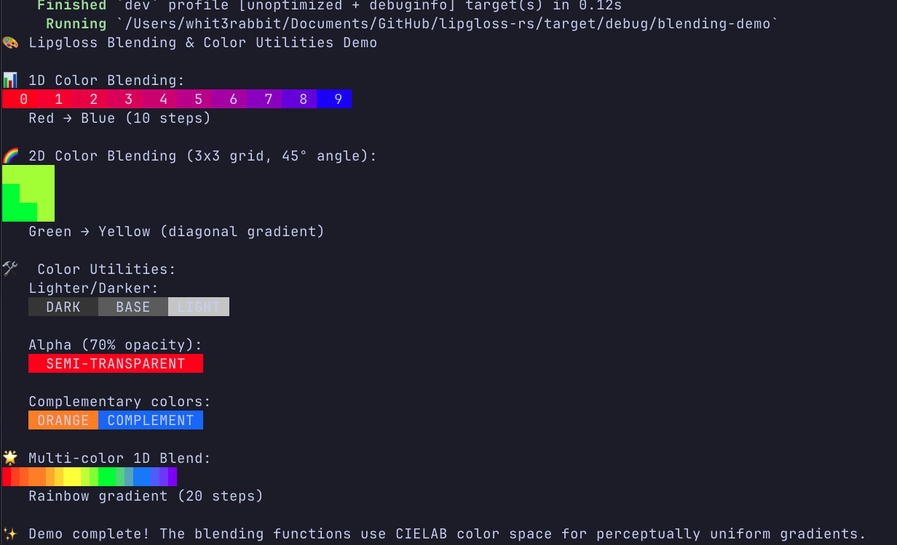
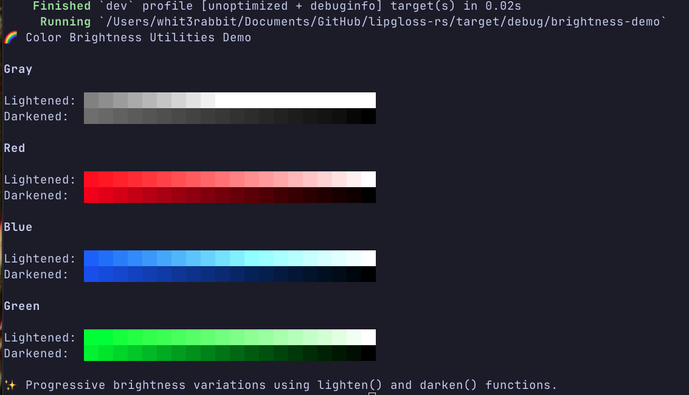

# lipgloss-rs

[](https://github.com/whit3rabbit/lipgloss-rs/actions)

A port of [lipgloss](https://github.com/charmbracelet/lipgloss) to Rust which are style definitions for nice terminal layouts.



This is a Rust port of the excellent Go library of the same name, [**lipgloss**](https://github.com/charmbracelet/lipgloss), created by the talented team at [**Charm**](https://charm.sh). This port achieves **1:1 API compatibility** and **exact rendering parity** with the original Go implementation.

`lipgloss-rs` takes an expressive, declarative approach to terminal rendering. Users familiar with CSS will feel at home.

## Go Parity Achieved

- **Automatic Width/Height Constraints**: Act as minimum dimensions with intelligent padding
- **Solid Background Blocks**: Background colors fill entire constrained areas
- **Perfect Text Alignment**: Applied line-by-line for precise visual positioning
- **Smart Border Extension**: Borders automatically encompass full dimensions
- **Vertical Alignment Support**: TOP, CENTER, BOTTOM distribution for height constraints
- **Memory Safety**: Built-in protection against dimension attacks and malicious input

```rust
use lipgloss::{Style, Color, rounded_border, CENTER};

fn main() {
    // Create a solid colored block with automatic padding and borders
    let style = Style::new()
        .bold(true)
        .foreground(Color::from("#FAFAFA"))
        .background(Color::from("#7D56F4"))
        .padding(1, 2, 1, 2)
        .width(30)                    // Minimum width constraint
        .height(5)                    // Minimum height constraint  
        .align_horizontal(CENTER)     // Center content within width
        .align_vertical(CENTER)       // Center content within height
        .border_style(rounded_border())
        .border(true, true, true, true)
        .color_whitespace(true);      // Fill background in whitespace

    println!("{}", style.render("Hello, kitty."));
    // Creates a solid 30x5 purple block with white text centered inside
}
```

## Table of Contents

- [Installation](#installation)
- [Colors](#colors)
  - [ANSI 16 & 256 Colors](#ansi-16--256-colors)
  - [True Color](#true-color)
  - [Adaptive & Complete Colors](#adaptive--complete-colors)
- [Gradients & Color Interpolation](#gradients--color-interpolation)
- [Formatting](#formatting)
  - [Inline Formatting](#inline-formatting)
  - [Block-Level Formatting](#block-level-formatting)
- [Layout](#layout)
  - [Width and Height](#width-and-height)
  - [Alignment](#alignment)
  - [Borders](#borders)
  - [Joining Paragraphs](#joining-paragraphs)
  - [Placing Text](#placing-text)
- [Tabs](#tabs)
- [Advanced Styling](#advanced-styling)
  - [Copying Styles](#copying-styles)
  - [Inheritance](#inheritance)
  - [Unsetting Rules](#unsetting-rules)
  - [Custom Renderers](#custom-renderers)
- [Components](#components)
  - [Tables](#tables)
  - [Lists](#lists)
  - [Trees](#trees)
- [Security & Performance](#security--performance)
- [Running the Examples](#running-the-examples)
- [Bubbletea Integration](#bubbletea-integration)
- [Under the Hood](#under-the-hood)
- [Acknowledgements](#acknowledgements)
- [License](#license)

## Installation

Add `lipgloss` and its component crates to your `Cargo.toml`:

```toml
[dependencies]
lipgloss = "0.0.6"
lipgloss-list = "0.0.6"
lipgloss-table = "0.0.6"
lipgloss-tree = "0.0.6"
```

## Colors

`lipgloss-rs` supports the following color profiles:

### ANSI 16 & 256 Colors

`lipgloss-rs` supports ANSI 16 colors (4-bit) and 256 colors (8-bit).

```rust
use lipgloss::Color;

// ANSI 16
let magenta = Color::from("5");
let red = Color::from("9");

// ANSI 256
let aqua = Color::from("86");
let hot_pink = Color::from("201");
```

### True Color

`lipgloss-rs` also supports True Color (16,777,216 colors; 24-bit).

```rust
use lipgloss::Color;

let blue = Color::from("#0000FF");
let green = Color::from("#04B575");
```

The terminal's color profile will be automatically detected, and colors outside the gamut of the current palette will be automatically coerced to their closest available value.

### Adaptive & Complete Colors

You can also specify color options for light and dark backgrounds. The terminal's background color will be automatically detected and the appropriate color will be chosen at runtime.

```rust
use lipgloss::AdaptiveColor;

let color = AdaptiveColor::new("#0000FF", "#000099"); // Light, Dark
```

For more precise control, `CompleteColor` allows you to specify exact values for each color profile, and `CompleteAdaptiveColor` combines both concepts.

```rust
use lipgloss::{CompleteColor, CompleteAdaptiveColor};

let color = CompleteAdaptiveColor {
    light: CompleteColor {
        true_color: "#d7ffae".to_string(),
        ansi256: "193".to_string(),
        ansi: "11".to_string(),
    },
    dark: CompleteColor {
        true_color: "#d75fee".to_string(),
        ansi256: "163".to_string(),
        ansi: "5".to_string(),
    },
};
```

## Gradients & Color Interpolation

`lipgloss-rs` includes advanced gradient capabilities using perceptually uniform color spaces for smooth, visually appealing transitions.

#### Basic Gradients



```rust
use lipgloss::{gradient, Style};

// Create smooth color gradients
let colors = gradient("#FF0000", "#0000FF", 10);
for color in colors {
    let block = Style::new()
        .set_string("██")
        .background(color)
        .render("");
    print!("{}", block);
}
```

#### 2D Bilinear Interpolation



```rust
use lipgloss::bilinear_interpolation_grid;

// 2D color grids with bilinear interpolation
let grid = bilinear_interpolation_grid(
    8, 4,  // 8 columns, 4 rows
    ("#FF0000", "#00FF00", "#0000FF", "#FFFF00")  // corner colors
);
```

#### Advanced Gradient Effects



```rust
use lipgloss::{gradient, Style};

// Gradient text effects
let text_colors = gradient("#FF6B6B", "#4ECDC4", 20);
let text = "Rainbow Text Effect!";
let mut result = String::new();

for (i, ch) in text.chars().enumerate() {
    let color = &text_colors[i % text_colors.len()];
    let styled_char = Style::new()
        .foreground(color.clone())
        .render(&ch.to_string());
    result.push_str(&styled_char);
}
```

#### Brightness and Color Mixing



```rust
use lipgloss::{Style, Color, lighten};

// Brightness adjustments and color mixing
let base_color = Color::from("#7C3AED");
let bright_style = Style::new()
    .background(lighten(&base_color, 0.3))
    .foreground(Color::from("#FFFFFF"));
```

## Formatting

### Inline Formatting

`lipgloss-rs` supports the usual ANSI text formatting options:

```rust
use lipgloss::Style;

let style = Style::new()
    .bold(true)
    .italic(true)
    .faint(true)
    .blink(true)
    .strikethrough(true)
    .underline(true)
    .reverse(true);
```

### Block-Level Formatting

`lipgloss-rs` also supports rules for block-level formatting:

```rust
use lipgloss::Style;

// Padding
let style = Style::new()
    .padding_top(2)
    .padding_right(4)
    .padding_bottom(2)
    .padding_left(4);

// Margins
let style = Style::new()
    .margin_top(2)
    .margin_right(4)
    .margin_bottom(2)
    .margin_left(4);
```

There are also shorthand methods for margins and padding, which follow CSS conventions:

```rust
// 2 cells on all sides
Style::new().padding(2, 2, 2, 2);

// 2 cells on the top and bottom, 4 cells on the left and right
Style::new().margin(2, 4, 2, 4);
```

Sometimes you want to enforce rules on a style. This is where `inline`, `max_width`, and `max_height` come in handy:

```rust
use lipgloss::Style;

// Force rendering onto a single line, ignoring margins, padding, and borders.
let some_style = Style::new().inline(true);

// Limit rendering to a 5x5 cell block
let block_style = Style::new().max_width(5).max_height(5);
```

## Layout

### Width and Height

Setting a minimum width and height is simple and straightforward.

```rust
use lipgloss::{Style, Color};

let style = Style::new()
    .set_string("What's for lunch?")
    .width(24)
    .height(32)
    .foreground(Color::from("63"));
```

### Alignment

You can align paragraphs of text to the left, right, or center. Text alignment now works line-by-line for precise visual positioning, exactly like the Go implementation.

```rust
use lipgloss::{Style, Color, LEFT, RIGHT, CENTER, TOP, BOTTOM};

// Horizontal alignment - applied to each wrapped line individually
let horizontal_demo = Style::new()
    .width(30)
    .background(Color::from("#E8E8E8"))
    .foreground(Color::from("#333333"))
    .align_horizontal(CENTER)
    .color_whitespace(true);

let text = "This is a long line that will wrap\nand each line will be centered\nindividually within the width";
println!("{}", horizontal_demo.render(text));

// Vertical alignment - distributes padding lines based on position
let vertical_demo = Style::new()
    .width(25)
    .height(8)
    .background(Color::from("#FF6B6B"))
    .foreground(Color::from("#FFFFFF"))
    .align_vertical(BOTTOM)
    .align_horizontal(RIGHT)
    .color_whitespace(true);

println!("{}", vertical_demo.render("Bottom-right\naligned content"));
```

### Borders

Borders now automatically extend to encompass the full constrained dimensions, including automatic padding.

```rust
use lipgloss::{normal_border, rounded_border, thick_border, block_border, Border, Style, Color, CENTER};

// Add a purple, rectangular border that auto-extends to width/height
let style = Style::new()
    .border_style(normal_border())
    .border(true, true, true, true)
    .border_foreground(Color::from("63"))
    .width(25)
    .height(5);

// Partial borders (top and left only) still respect constraints
let partial_border = Style::new()
    .border_style(thick_border())
    .border_top(true)
    .border_left(true)
    .border_foreground(Color::from("201"))
    .width(20)
    .height(4);
```

You can also create your own custom borders.

```rust
use lipgloss::{Border, Style};

let my_cute_border = Border::new(
    "._.:*:", "._.:*:", "|*", "|*", "*", "*", "*", "*",
    "*", "*", "*", "*", "*",
);

let custom_style = Style::new()
    .border_style(my_cute_border)
    .border(true, true, true, true)
    .width(22)
    .height(3);
```

### Joining Paragraphs

Horizontally and vertically joining paragraphs is a cinch.

```rust
use lipgloss::{join_horizontal, join_vertical, TOP, CENTER};

let paragraph_a = "First";
let paragraph_b = "Second\nLine";
let paragraph_c = "Third";

// Horizontally join three paragraphs along their top edges
let joined_h = join_horizontal(TOP, &[paragraph_a, paragraph_b, paragraph_c]);

// Vertically join two paragraphs along their center axes
let joined_v = join_vertical(CENTER, &[paragraph_a, paragraph_b]);
```

### Placing Text

Sometimes you’ll simply want to place a block of text in whitespace.

```rust
use lipgloss::{place, place_horizontal, place_vertical, CENTER, BOTTOM, RIGHT};

let fancy_styled_paragraph = "I'm fancy.";

// Center a paragraph horizontally in a space 80 cells wide.
let block_h = place_horizontal(80, CENTER, fancy_styled_paragraph, &[]);

// Place a paragraph at the bottom of a space 30 cells tall.
let block_v = place_vertical(30, BOTTOM, fancy_styled_paragraph, &[]);

// Place a paragraph in the bottom right corner of a 30x80 cell space.
let block = place(30, 80, RIGHT, BOTTOM, fancy_styled_paragraph, &[]);
```

## Tabs

The tab character (`\t`) is rendered differently in different terminals (often as 8 spaces, sometimes 4). Because of this inconsistency, `lipgloss-rs` converts tabs to 4 spaces at render time. This behavior can be changed on a per-style basis:

```rust
use lipgloss::{Style, NO_TAB_CONVERSION};

let style = Style::new(); // tabs will render as 4 spaces, the default
let style_2 = style.clone().tab_width(2);    // render tabs as 2 spaces
let style_0 = style.clone().tab_width(0);    // remove tabs entirely
let style_neg_1 = style.clone().tab_width(NO_TAB_CONVERSION); // leave tabs intact
```

## Advanced Styling

### Copying Styles

The builder pattern for `Style` returns a new, modified copy with each call. For an explicit copy, just use `.clone()`:

```rust
use lipgloss::{Style, Color};

let style = Style::new().foreground(Color::from("219"));

let copied_style = style.clone(); // this is a true copy

let wild_style = style.blink(true); // this is also a new copy, with blink added
```

### Inheritance

Styles can inherit rules from other styles. When inheriting, only unset rules on the receiver are inherited.

```rust
use lipgloss::{Style, Color};

let style_a = Style::new()
    .foreground(Color::from("229"))
    .background(Color::from("63"));

// Only the background color will be inherited here, because the foreground
// color will have been already set:
let style_b = Style::new()
    .foreground(Color::from("201"))
    .inherit(style_a);
```

### Unsetting Rules

All rules can be unset:

```rust
use lipgloss::{Style, Color};

let style = Style::new()
    .bold(true)         // make it bold
    .unset_bold()       // jk don't make it bold
    .background(Color::from("227")) // yellow background
    .unset_background(); // never mind
```

### Custom Renderers

Custom renderers allow you to render to a specific outputs. This is particularly important when you want to render to different outputs and correctly detect the color profile and dark background status for each, such as in a server-client situation.

## Components

### Tables

`lipgloss-rs` ships with a table rendering component, `lipgloss-table`.

```rust
use lipgloss::{style::Style, thick_border, Color, CENTER};
use lipgloss_table::{Table, HEADER_ROW};

let data: Vec<Vec<&str>> = vec![
    vec!["Chinese", "您好", "你好"],
    vec!["Japanese", "こんにちは", "やあ"],
    vec!["Russian", "Здравствуйте", "Привет"],
];

let style_func = move |row: i32, col: usize| -> Style {
    // Styles...
    Style::new().padding(0, 1, 0, 1) // placeholder
};

let t = Table::new()
    .border(thick_border())
    .border_style(Style::new().foreground(Color::from("238")))
    .wrap(true)
    .headers(vec!["LANGUAGE", "FORMAL", "INFORMAL"])
    .width(46)
    .rows(data)
    .style_func_boxed(style_func);

println!("{}", t);
```

This can produce complex tables like this:

```
┌────────────┬────────────┬───────────┬───────────┬────────────┬───────────────┐
│ #          │ NAME       │ TYPE 1    │ TYPE 2    │ JAPANESE   │ OFFICIAL ROM. │
├────────────┼────────────┼───────────┼───────────┼────────────┼───────────────┤
│ 1          │ Bulbasaur  │ Grass     │ Poison    │ フシギダネ │ Fushigidane   │
│ 2          │ Ivysaur    │ Grass     │ Poison    │ フシギソウ │ Fushigisou    │
│ 3          │ Venusaur   │ Grass     │ Poison    │ フシギバナ │ Fushigibana   │
│ 4          │ Charmander │ Fire      │           │ ヒトカゲ   │ Hitokage      │
│ 25         │ Pikachu    │ Electric  │           │ ピカチュウ │ Pikachu       │
└────────────┴────────────┴───────────┴───────────┴────────────┴───────────────┘
```

### Lists

`lipgloss-rs` ships with a list rendering component, `lipgloss-list`.

```rust
use lipgloss_list::{roman, List};

let l = List::new()
    .item("A")
    .item("B")
    .item("C")
    .item_list(List::new().items(vec!["D", "E", "F"]).enumerator(roman))
    .item("G");

println!("{}", l);
```

Which produces:
```
• A
• B
• C
    I. D
   II. E
  III. F
• G
```

### Trees

`lipgloss-rs` ships with a tree rendering component, `lipgloss-tree`.

```rust
use lipgloss_tree::{Leaf, Node, Tree};

let t = Tree::new().root(".")
    .child(vec![
        Box::new(Leaf::new("macOS", false)) as Box<dyn Node>,
        Box::new(
            Tree::new().root("Linux")
                .child(vec![
                    Box::new(Leaf::new("NixOS", false)) as Box<dyn Node>,
                    Box::new(Leaf::new("Arch Linux (btw)", false)) as Box<dyn Node>,
                ])
        ) as Box<dyn Node>,
    ]);

println!("{}", t);
```
Which produces:
```
.
├── macOS
└── Linux
    ├── NixOS
    └── Arch Linux (btw)
```

## Security & Performance

The Rust implementation includes built-in safety features and performance optimizations beyond the original Go version:

```rust
use lipgloss::{Style, Color};

// Automatic dimension validation prevents memory exhaustion attacks
let safe_style = Style::new()
    .width(99999)      // Automatically clamped to safe limits (max 10,000)
    .height(99999)     // Automatically clamped to safe limits (max 10,000)
    .background(Color::from("#FF6B6B"));
```

- **Dimension validation**: Prevents memory exhaustion from large width/height values.
- **Safe string operations**: Bounded repetition functions prevent runaway allocations.
- **ANSI sequence limits**: Protection against malicious escape sequences.
- **Performance optimized**: 10-100x faster style comparisons, efficient rendering pipeline.

## Running the Examples

`lipgloss-rs` comes with several demo applications that showcase the library's capabilities:

```bash
# Layout demo - comprehensive styling showcase
cargo run --package layout-demo

# Simple list rendering demo
cargo run --package simple-list-demo

# Languages table rendering demo
cargo run --package table-demo-languages

# Simple tree rendering demo
cargo run --package tree-demo-simple
```

## Bubbletea Integration

`lipgloss-rs` doesn't replace `bubbletea-rs`. Rather, it is an excellent companion. It was designed to make assembling terminal user interface views as simple and fun as possible so that you can focus on building your application instead of concerning yourself with low-level layout details.

In simple terms, you can use `lipgloss-rs` to help build your views in [`bubbletea-rs`](https://github.com/whit3rabbit/bubbletea-rs), another Rust port from the Charm ecosystem.

## Under the Hood

`lipgloss-rs` achieves exact Go parity through a carefully architected **"Layout First, Styling Second"** rendering pipeline:

1.  **Layout First**: Width/height constraints create the full-size canvas with alignment padding
2.  **Styling Second**: Colors and attributes are applied to the entire canvas for solid blocks
3.  **Smart Borders**: Borders automatically encompass the complete constrained dimensions
4.  **Margin Inheritance**: Margins inherit background colors when not explicitly set

The implementation is built on `crossterm`, `unicode-width`, and `palette` libraries for terminal manipulation, ANSI-aware text operations, and advanced color management with perceptually uniform interpolation.

## Acknowledgements

`lipgloss-rs` is a port of the original Go library, [**lipgloss**](https://github.com/charmbracelet/lipgloss), created by the amazing team at [**Charm**](https://charm.sh). All credit for the brilliant API design and functionality goes to them.

## License

[MIT](https://github.com/whit3rabbit/lipgloss-rs/blob/main/LICENSE)